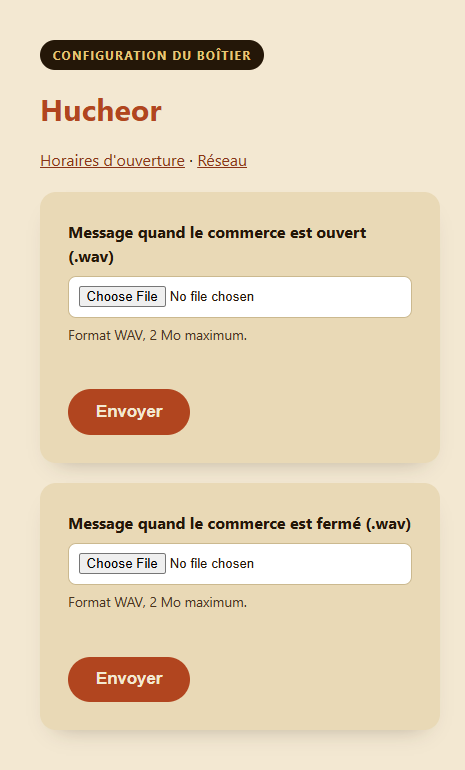
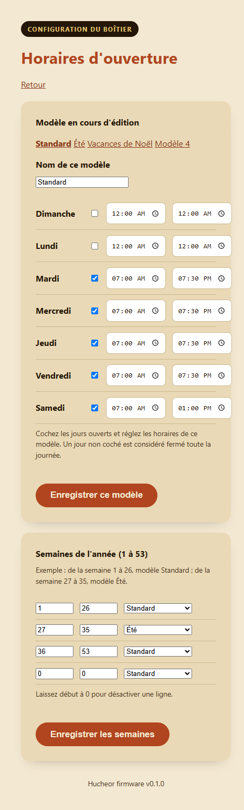
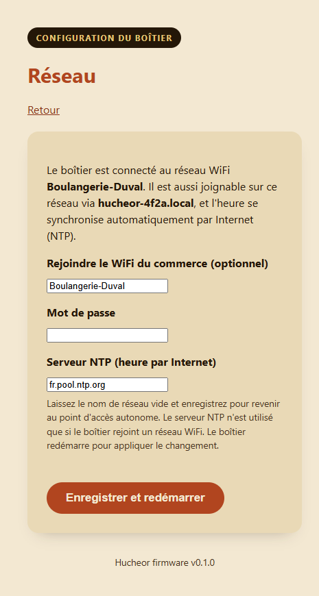

# Hucheor Hardware

Matériel et firmware pour **Hucheor**, une balise sonore pour les commerces de proximité qui
répond à la télécommande normalisée française utilisée par les personnes aveugles et malvoyantes
(NF S32-002, 868,3 MHz).

"Hucheor" est un mot de vieux français pour "celui qui appelle, qui guide".

Ce dépôt contient tout ce qui est destiné à être librement partagé et auto-constructible :

- `firmware/` : firmware ESP32 (décodage radio, lecture audio, configuration WiFi)
- `hardware/` : schémas KiCad et fichiers Gerber du circuit imprimé
- `enclosure/` : fichiers d'impression 3D du boîtier (STL)
- `docs/` : captures d'écran et maquettes HTML autonomes de l'interface de configuration (pour
  prévisualiser/tester les pages web sans flasher de matériel réel, voir
  [Interface de configuration](#interface-de-configuration) plus bas)

Le projet global (contexte métier, déploiement, site web) vit dans un dépôt privé séparé. Celui-ci
est la partie publique, en accès libre : n'importe qui peut récupérer ces fichiers, construire sa
propre balise Hucheor pour un usage personnel ou interne, et la modifier. Voir
[NOTICE.md](NOTICE.md) pour ce que ça permet exactement (et ce que ça ne permet pas) : ce n'est
**pas** une licence open source au sens OSI, la revente commerciale est volontairement exclue.

## État

**Firmware v1 en développement actif.** L'essentiel de la partie logicielle qui ne dépend pas
d'avoir du matériel physique en main est implémenté et testé (lecture audio, planification,
synchronisation de l'horloge, réseau, interface de configuration, CI). Ce qui manque encore : le
décodage radio NF S32-002 lui-même (bloqué sur la capture d'un signal réel, voir
[Approche](#approche)) et le prototype physique lui-même.

| Domaine | État |
|---|---|
| Réception radio (CC1101 @ 868,3 MHz) | Initialisation + capture brute des fronts uniquement. La reconnaissance de trame (`matchesNfS32002Frame()`) renvoie toujours `false` pour l'instant : volontairement laissé non implémenté tant qu'une vraie capture RTL-SDR n'est pas disponible, voir plus bas. |
| Lecture audio | Fait. WAV (16 bits mono/stéréo) depuis LittleFS via I2S, voir [Lecture audio](#lecture-audio). |
| Planification des horaires d'ouverture | Fait. Modèles saisonniers + plages de semaines, voir [Planification](#planification-horaires-saisonniers). |
| Synchronisation de l'horloge | Fait. Trois sources indépendantes (DCF77, téléphone, NTP), voir [Synchronisation de l'horloge](#synchronisation-de-lhorloge). |
| Réseau (modes point d'accès / station) | Fait. Repli automatique, mDNS, serveur NTP configurable, voir [Modes réseau](#modes-réseau). |
| Interface web de configuration | Fait. Voir [Interface de configuration](#interface-de-configuration). |
| Sécurité | Audité, correctifs appliqués, voir [Sécurité](#sécurité). |
| CI | Build du firmware à chaque push + vérification hebdomadaire des dépendances, voir [Intégration continue](#intégration-continue). |
| Matériel / boîtier | Pas commencé, en attente d'un prototype firmware validé d'abord. |

## Comment ça marche

1. Une personne aveugle ou malvoyante a sur elle la télécommande NF S32-002 déjà distribuée à
   l'échelle nationale (la même que celle utilisée pour les feux piétons sonores et les bâtiments
   publics). Rien de nouveau à transporter.
2. Elle la pointe vers un commerce équipé d'une balise Hucheor et appuie sur le bouton, exactement
   comme elle le ferait devant la balise sonore d'un bâtiment public.
3. La balise (ESP32 + module radio CC1101) capte le signal 868,3 MHz, le reconnaît comme une trame
   NF S32-002, et lit les horaires d'ouverture configurés du commerce pour l'instant présent.
4. Elle diffuse un court message enregistré sur un haut-parleur (ampli I2S MAX98357A) : le nom du
   commerce, et s'il est actuellement ouvert ou fermé.

Aucune application, aucun smartphone requis pour l'usage principal : la télécommande existante est
toute l'interface. Voir la [Feuille de route](#feuille-de-route) pour ce qu'une future application
compagnon ajouterait en plus.

## Lecture audio

`firmware/src/audio_player.{h,cpp}`. Joue des fichiers WAV 16 bits (mono ou stéréo, n'importe
quelle fréquence d'échantillonnage) stockés sur le système de fichiers LittleFS interne de l'ESP32,
via I2S. Le commerçant envoie deux fichiers WAV via l'interface de configuration : un joué quand le
commerce est ouvert, un quand il est fermé (voir
[Interface de configuration](#interface-de-configuration)). Si aucun des deux n'a jamais été
envoyé (ou si les horaires n'ont jamais été configurés), le firmware se rabat sur un
`/message.wav` générique unique plutôt que de rester silencieux.

Le parseur WAV analyse les chunks au lieu de supposer un en-tête fixe de 44 octets (gère les
fichiers avec des chunks `LIST`/`fact` supplémentaires avant `data`), et est durci contre les
fichiers malformés (voir [Sécurité](#sécurité)).

Aucune bibliothèque audio tierce n'est utilisée : le choix évident, ESP8266Audio, est sous licence
GPLv3, ce qui forcerait tout ce dépôt sous une licence copyleft incompatible avec
[la licence ci-dessous](#licence). Le parsing WAV et la lecture I2S sont implémentés directement
au-dessus du `driver/i2s.h` natif du core Arduino ESP32.

## Planification (horaires saisonniers)

`firmware/src/schedule.{h,cpp}`. Les horaires d'ouverture d'un commerce sont rarement les mêmes
toute l'année (horaires d'été, fermeture de Noël, etc.), donc la planification est construite
autour de **modèles**, pas d'un horaire hebdomadaire fixe unique :

- Jusqu'à **4 modèles nommés** (ex. "Standard", "Été", "Vacances de Noël"), chacun un horaire
  hebdomadaire complet sur 7 jours (activé/désactivé par jour, heure d'ouverture, heure de
  fermeture). Un jour peut aussi être une plage nocturne (ferme après minuit, ex. un bar ouvert de
  20h à 2h) : le firmware le détecte automatiquement quand l'heure de fermeture est antérieure à
  l'heure d'ouverture.
- Jusqu'à **12 plages de numéros de semaine ISO** (1-53), chacune assignée à l'un des 4 modèles.
  Une semaine sans plage correspondante se rabat sur le premier modèle. Exemple : semaines 1 à 26
  utilisent "Standard", semaines 27 à 35 utilisent "Été", semaines 36 à 53 utilisent "Standard" à
  nouveau.

Tout ça se modifie depuis le navigateur du téléphone via l'[interface de
configuration](#interface-de-configuration), pas besoin de reflasher pour changer les horaires.

**Sécurité par défaut** : juste après un démarrage à froid ou une coupure de courant, avant qu'une
source d'heure n'ait synchronisé, l'horloge système affiche une valeur proche de zéro
(1970-01-01). `isOpenNow()` refuse de répondre dans ce cas et annonce "fermé" plutôt que de deviner
avec assurance un statut arbitraire à partir d'une date bidon : "fermé" est la mauvaise réponse la
moins grave pour un visiteur aveugle que "ouvert".

## Synchronisation de l'horloge

Le firmware ne calcule jamais lui-même l'heure d'été/d'hiver (CET/CEST). Chaque source d'horloge
est responsable de résoudre le changement d'heure de son côté et de transmettre **l'heure locale
française de l'horloge murale**, encodée comme si c'était de l'UTC : `Schedule` la relit toujours
avec `gmtime_r()`, jamais `localtime_r()`, donc aucune règle de changement d'heure européenne n'est
codée en dur nulle part dans ce firmware (une règle qui pourrait changer : il y a eu de vraies
discussions européennes sur l'abolition pure et simple du changement d'heure saisonnier).

Trois sources indépendantes, n'importe quelle combinaison d'entre elles peut être présente :

- **DCF77** (`firmware/src/dcf77_clock.{h,cpp}`) : un module récepteur grandes ondes 77,5 kHz
  optionnel. Décode le signal horaire allemand DCF77 (également reçu partout en France), qui
  diffuse déjà l'heure locale équivalente française plus des drapeaux CEST/CET en direct : aucune
  conversion nécessaire, fonctionne sans aucune connexion internet.
- **Synchronisation par téléphone** : visiter l'interface de configuration (n'importe quelle page)
  envoie les champs de l'horloge murale locale du téléphone qui configure (déjà ajustés pour le
  changement d'heure par la base de données de fuseaux horaires du système d'exploitation,
  régulièrement mise à jour) à la balise, via un petit script inline.
- **NTP** : disponible uniquement en [mode station](#modes-réseau) (accès internet). Un serveur NTP
  configurable (par défaut `fr.pool.ntp.org`) fournit l'UTC vrai, que le firmware convertit en
  heure locale française exactement une fois par synchronisation (une règle `TZ` transitoire
  appliquée puis immédiatement retirée : jamais laissée configurée en permanence) et se
  resynchronise automatiquement toutes les 6 heures pour corriger la dérive de l'horloge.

## Modes réseau

`firmware/src/network.{h,cpp}`. Deux modes de connexion, permutables depuis la page `/wifi` de
l'interface de configuration :

- **Autonome (par défaut)** : la balise crée son propre point d'accès WiFi (`Hucheor-XXXX`, WPA2,
  un mot de passe généré une fois par appareil). Pas d'accès internet : s'appuie sur DCF77 et/ou la
  synchronisation par téléphone pour l'heure.
- **Station** : la balise rejoint plutôt le réseau WiFi propre du commerce. Plus facile à
  atteindre pour la configuration (le téléphone reste sur son réseau habituel), découvrable via
  mDNS (`hucheor-xxxx.local`, aucune dépendance supplémentaire : `ESPmDNS` est fourni avec le core
  Arduino ESP32), et obtient une synchronisation NTP automatique de l'heure puisqu'elle a
  désormais accès à internet.

Se rabat automatiquement sur le mode autonome si des identifiants station sont configurés mais que
la connexion échoue (mauvais mot de passe, WiFi du commerce en panne, hors de portée) : une erreur
de configuration ne peut jamais rendre l'appareil inaccessible.

Non bloquant et résilient par conception : une connexion station perdue est retentée
automatiquement (délai de 30s entre tentatives, ne sature jamais la radio), et les resynchronisations
NTP se font en arrière-plan sans jamais bloquer la réception radio ou la lecture audio. La seule
attente volontairement bloquante est la tentative de connexion WiFi initiale au démarrage
(jusqu'à 15s, avant que quoi que ce soit d'autre n'ait démarré).

## Interface de configuration

`firmware/src/config_server.{h,cpp}`. Un petit serveur HTTP embarqué (aucune ressource externe,
fonctionne entièrement hors ligne sur le point d'accès autonome) pour que le commerçant configure
la balise depuis le navigateur de n'importe quel téléphone : aucune application requise pour la
configuration. Protégé par HTTP Digest Auth (un code à 12 chiffres, généré une fois par appareil,
jamais envoyé en clair sur le réseau : voir [Sécurité](#sécurité)). Le pied de page de chaque page
affiche la version du firmware en cours d'exécution (voir [Versionnage](#versionnage)).

| Page | À quoi ça sert |
|---|---|
| `/` | Envoyer les messages WAV "ouvert" et "fermé" (2 Mo max chacun). |
| `/schedule` | Modifier les modèles d'horaires d'ouverture et leur assigner des plages de semaines, voir [Planification](#planification-horaires-saisonniers). |
| `/wifi` | Basculer entre mode autonome/station, définir les identifiants WiFi du commerce, configurer le serveur NTP. |

Captures d'écran (générées à partir des maquettes autonomes dans
[`docs/mockups/`](docs/mockups/), qui reproduisent le HTML réellement généré par le firmware
au caractère près : utiles pour prévisualiser un changement d'interface sans flasher un appareil
réel) :

<table>
<tr>
<td></td>
<td></td>
<td></td>
</tr>
</table>

Même thème visuel que le site public ("Le Héraut" : parchemin/encre/terracotta), une pile de
polices système à la place des polices web personnalisées du site (inaccessibles depuis un point
d'accès hors ligne sans internet), et construit pour être utilisable : de vrais `<label>`, de
grandes cibles tactiles, des contours de focus visibles, aucun JavaScript en dehors du petit
script inline de synchronisation d'horloge.

### Parcours de première configuration

1. Flasher le firmware (voir [Compiler le firmware](#compiler-le-firmware)).
2. Allumer la balise. Elle démarre en mode autonome, en créant un réseau WiFi nommé
   `Hucheor-XXXX` (le suffixe exact vient de l'adresse MAC de l'appareil, affiché sur la console
   série au démarrage aux côtés des mots de passe WPA2 et de configuration).
3. Sur un téléphone, rejoindre ce réseau WiFi et ouvrir `http://hucheor-xxxx.local` (ou l'IP du
   point d'accès, `192.168.4.1`) dans un navigateur.
4. Se connecter avec les identifiants HTTP Digest affichés sur la console série au démarrage.
5. Envoyer les messages WAV "ouvert" et "fermé" sur la page d'accueil.
6. Aller sur **Horaires d'ouverture** et configurer au moins les horaires hebdomadaires du modèle
   "Standard". Ajouter des modèles saisonniers et des plages de semaines si besoin.
7. Optionnellement, aller sur **Réseau** et saisir les identifiants WiFi du commerce pour basculer
   en mode station (recommandé une fois la configuration faite : synchronisation automatique de
   l'heure par internet et accessibilité au quotidien plus simple via `hucheor-xxxx.local`).
8. Terminé : la balise répond désormais à toute télécommande NF S32-002 à portée.

## Sécurité

Audité selon une checklist adaptée à ce contexte embarqué ESP32 (pas un backend web classique),
centrée sur les deux nouvelles surfaces d'attaque : le serveur de configuration (traite des envois
et des identifiants non fiables) et le parseur WAV (traite du contenu de fichier non fiable).

**Corrigé :**
- Underflow entier dans le parseur du chunk `fmt ` d'un WAV (une taille de chunk malformée
  inférieure à 16 octets débordait en arithmétique non signée vers un offset `seek()` énorme) :
  désormais rejeté explicitement.
- La valeur de retour de `seek()` n'était jamais vérifiée, ce qui pouvait laisser un fichier WAV
  malformé faire tourner la boucle du parseur indéfiniment (déni de service) : interrompt
  désormais le parsing au moindre échec de `seek()`.
- Aucune limite de taille sur les envois : plafonné à 2 Mo par fichier, largement suffisant pour un
  message vocal court, les envois tronqués/corrompus sont supprimés plutôt que laissés comme
  message actif.
- `esp_random()` (utilisé pour générer les mots de passe WiFi et HTTP) était appelé avant
  l'activation de la radio WiFi, ce qui affaiblit son entropie selon la documentation même
  d'Espressif : réordonné pour que l'initialisation radio se fasse d'abord.
- Une seule écriture I2S en `portMAX_DELAY` sans timeout pouvait bloquer tout le firmware
  indéfiniment si l'ampli audio arrêtait de vider son tampon DMA (matériel déconnecté/défaillant) :
  remplacé par un timeout généreusement borné de 2 secondes, la lecture s'interrompt proprement au
  lieu de figer l'appareil.

**Par conception, pas une faille** : le serveur de configuration utilise HTTP Digest Auth (via le
challenge par défaut d'`ESPAsyncWebServer`), pas Basic : le mot de passe n'est jamais envoyé en
clair, même sur un réseau WiFi non chiffré. Le TLS complet a été envisagé et volontairement écarté :
pas de support HTTPS mature dans la bibliothèque de serveur web utilisée ici, un certificat
auto-signé afficherait un avertissement "non sécurisé" inquiétant aux commerçants non techniciens à
chaque visite, et le modèle de menace réaliste (un attaquant devrait déjà être sur le même réseau
WiFi que le commerce) ne justifie pas la complexité supplémentaire.

**Risque accepté** : les deux mots de passe de l'appareil (point d'accès WiFi + HTTP Digest) sont
un code numérique à 12 chiffres sans verrouillage après échecs répétés (10^12 combinaisons, et un
attaquant est déjà contraint à la proximité physique WiFi : pas un service exposé à internet).

## Intégration continue

Trois workflows GitHub Actions :
- **Build** (`.github/workflows/build-firmware.yml`) : compile le firmware à chaque push/PR qui
  touche `firmware/`.
- **Vérification des dépendances** (`.github/workflows/check-deps.yml`) : tourne chaque semaine
  (et à la demande), vérifie les paquets PlatformIO obsolètes, et ouvre/ferme automatiquement une
  issue GitHub selon le résultat.
- **Release** (`.github/workflows/release.yml`) : déclenché en poussant un tag `vX.Y.Z`. Compile
  le firmware avec cette version injectée (voir [Versionnage](#versionnage) plus bas) et publie
  une GitHub Release avec `firmware.bin`/`firmware.elf` compilés en pièces jointes.

## Versionnage

La version affichée en bas de chaque page de l'[interface de
configuration](#interface-de-configuration) vient du tag Git utilisé pour compiler ce firmware,
jamais une valeur codée en dur dans le code. `firmware/scripts/gen_version.py` (un script
pre-build PlatformIO) génère `firmware/include/version.h` à partir de la variable d'environnement
`FIRMWARE_VERSION`, fixée au tag poussé par le workflow de release ci-dessus : se rabat sur
`"dev"` pour tout build qui n'est pas déclenché par un tag (builds locaux, vérifications CI
classiques de build/PR), donc il est toujours évident si un firmware donné vient d'une release
officielle. Même logique que les applications mobiles de cet écosystème (voir `docs/mobile-app-releases.md`
du dépôt admin) : la version est injectée au moment du build, jamais committée.

Pour publier une release : `git tag vX.Y.Z && git push origin vX.Y.Z`.

## Compiler le firmware

Nécessite [PlatformIO](https://platformio.org/). Depuis `firmware/` :

```sh
pio run            # compiler
pio run -t upload  # flasher un ESP32 connecté
```

## Feuille de route

- **v1 (MVP, en cours)** : réception NF S32-002 (868,3 MHz) + lecture audio par haut-parleur. Voir
  le tableau [État](#état) plus haut pour le détail de ce qui est fait.
- **v2 (Bluetooth LE Audio / Auracast)** : diffuser le message directement dans les aides auditives
  et écouteurs compatibles, en plus du haut-parleur. Aucune balise en accès libre ne combine
  aujourd'hui réception 868,3 MHz et Auracast. Pas une fonctionnalité ESP32 seul : l'Auracast
  complet (codec LC3, Broadcast Isochronous Streams, interopérabilité certifiée) nécessite un
  coprocesseur dédié, probablement un Nordic nRF5340 (module candidat : Aurawave AW100), qui
  dialogue avec l'ESP32 via UART/SPI.
- **v3 (application mobile compagnon)** : React Native / Expo (iOS + Android), cohérent avec le
  reste des applications mobiles de l'écosystème. Déclenchement BLE des balises, réception
  Auracast, annuaire des commerces équipés, mode navigation GPS. Reste compatible avec la
  télécommande physique NF S32-002 existante (l'application la complète, ne la remplace jamais).
- **v4 (écosystème)** : interface de gestion pour les commerçants, cartographie des balises basée
  sur OpenStreetMap, intégration annuaire.

La priorité reste de finir la v1 (vraie capture radio + un prototype câblé) avant de démarrer la
v2.

## Accessibilité

Ce projet existe pour les personnes aveugles et malvoyantes. Toute interface construite ici
(interface web de configuration du firmware, future application compagnon) doit viser **WCAG 2.2
AA au minimum** dès le premier jet : contraste fort, tailles de police généreuses, aucun texte
porté uniquement par une image, navigation clavier complète, attributs ARIA corrects, respect des
préférences de mouvement réduit. Ce n'est pas optionnel sur ce projet.

## Approche

Le firmware de Hucheor est écrit indépendamment, à partir de zéro, en utilisant uniquement les
paramètres radio publiquement documentés de la norme NF S32-002 (868,3 MHz, OOK) : aucun code
emprunté.

Le décodage de trame radio est volontairement laissé non implémenté (`matchesNfS32002Frame()`
renvoie toujours `false`) tant qu'un signal réel n'a pas été capturé au RTL-SDR depuis une vraie
télécommande NF S32-002 : aucune constante de timing devinée ou empruntée à un autre projet.

## Licence

**CC BY-NC 4.0** (Attribution-NonCommercial). Voir [NOTICE.md](NOTICE.md) pour ce que ça veut dire
en pratique, et [LICENSE.md](LICENSE.md) pour le texte légal complet. En résumé : construisez-en
une pour vous-même, pour un ami gratuitement, ou pour l'usage interne de votre propre
organisation, et modifiez/partagez librement, mais personne à part BREIZHZION ne peut vendre,
faire payer, ou fournir commercialement d'une autre façon une balise Hucheor ou un appareil
construit à partir de ces fichiers, associations à but non lucratif comprises.

Ce n'est volontairement **pas une licence open source au sens OSI** : la revente commerciale est
exclue, donc ce projet doit être décrit comme en accès libre, pas open source.
